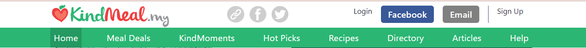
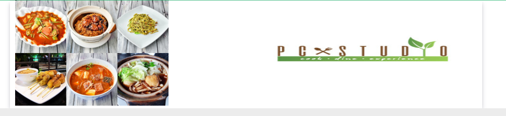
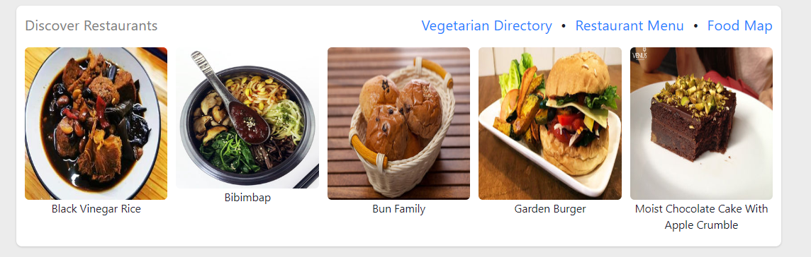
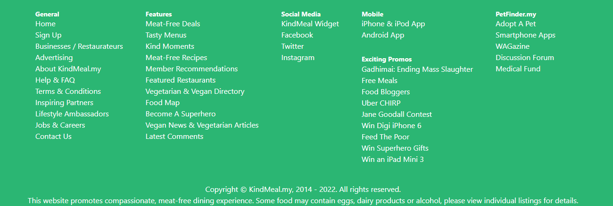
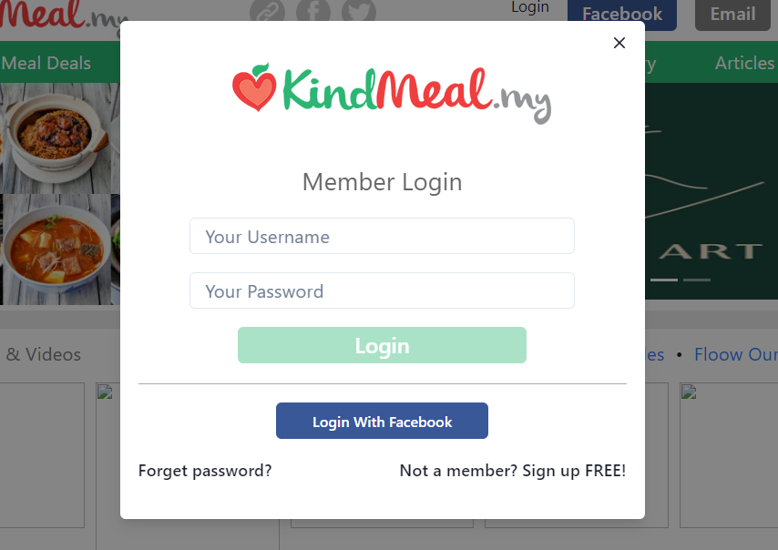
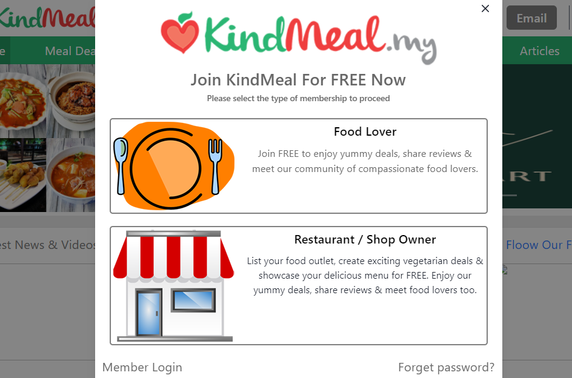
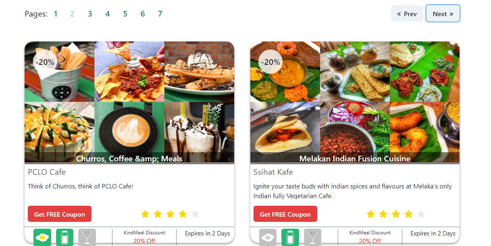

# KindMeal.com
### This is basically the clone of the original Kindmeal.com website.

#### we have used the following Tech Skills in the project:-
- React JS
- Chakra UI
- React Bootstrap

#### In this clone we have included most of the functionalities of the original website. The functionalities that we have implemented in this projects are:

1. **Landing Page** 
    - Navbar
    

    - Body 
        - Carousel 

        - Showing Blog posts 

    - Footer
      

2. **Login & SignUp form**
    Featured overlay form for both Login & Signup Form with the help Chakra UI components
     

3. **Listing Page Food**
    In the listing page features involved  
    - Pagination
    - Images
    - Discount overlay on Images
    - Lable overlay Images
    - API fetching
    

Got any cool Idea or just want to say hi ping me any time i will get back to you as soon as i can 	:relaxed:

 **Thank You !** 

